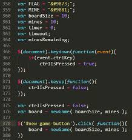

## New to JavaScript

JavaScript is a simple and useful coding program language. Its code styles and formats are easy to understand and learn. For people that are planning to major in computer science and software engineering, JavaScript is the best coding program language to start. I am a completely new user of the JavaScript language. Before learning JavaScript, the most familiar programming language is Java, and comparing to Java, it has many similarities in the coding format and style. Which I am able to learn and get familiar at coding in JavaScript.In the JavaScript module, I learn many things about JavaScript coding, for example, the basic variables, function calls, operator, arguments, loop, and object properties. Especially the ES6, it provided a different experience and views to coding. ES6 introduced the spread operator using a function call and return a class or object variables, make the coding style shorter and effect.

In the ICS 314, JavaScript is useful and effective in learning software engineering, and the class provides practice WODs module (workout of the day) to us to get experience and skills to coding in JavaScript. WODs module is useful by using instruction and provides problems in javascript code to make me think and improve my skills for coding an operable program and solving the problem. This style of learning is enjoyable, and I hope by participating in WODs I will improve in coding skills after the semester.
