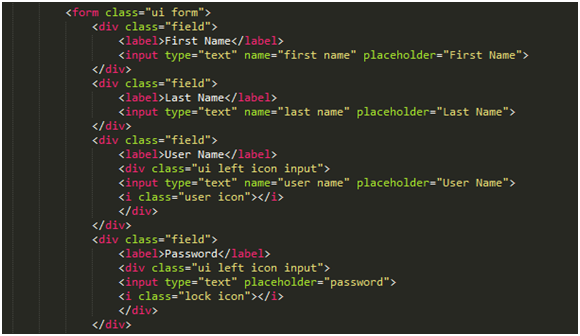

## UI Frameworks

  
UI Frameworks are a modern front-end development framework of a coding language, it was used to develop websites through jQuery. The UI is used in the HTML to set up the formal, style, layout, and elements for the website. The UI is using a component's essential quality from CSS and Javascript to run and set up the website. UI language is a simple, subtle, and user-friendly, and according to the Semantic UI, their goal of the UI framework is to empower designers and developers “by creating a language for sharing UI”.

## CSS Vs/And UI Frameworks

  CSS is a stylesheet language, and compare to UI, UI is the extent of CSS. CSS is a simple stylesheet language to set the background, color, word font, size, and layout of a website. However, UI is more focus on the layout and elements. The elements of UI are the button, icon, input, placeholder, label, list, divider, and more. Which the UI makes the coding easier to operate and layout the menu, information, and elements of the webpage.
  

Overall, the UI Frameworks are a useful style front-end development framework. By combining CSS and UI, it's easy to set up a friendly website, and better than using only CSS to layout a website.
