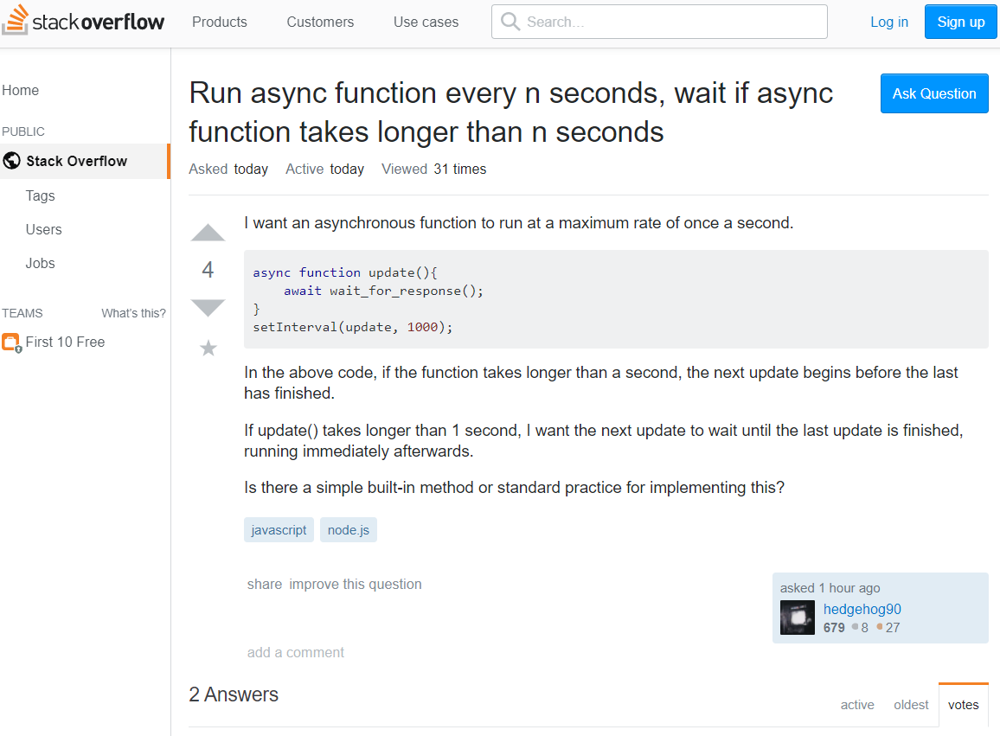
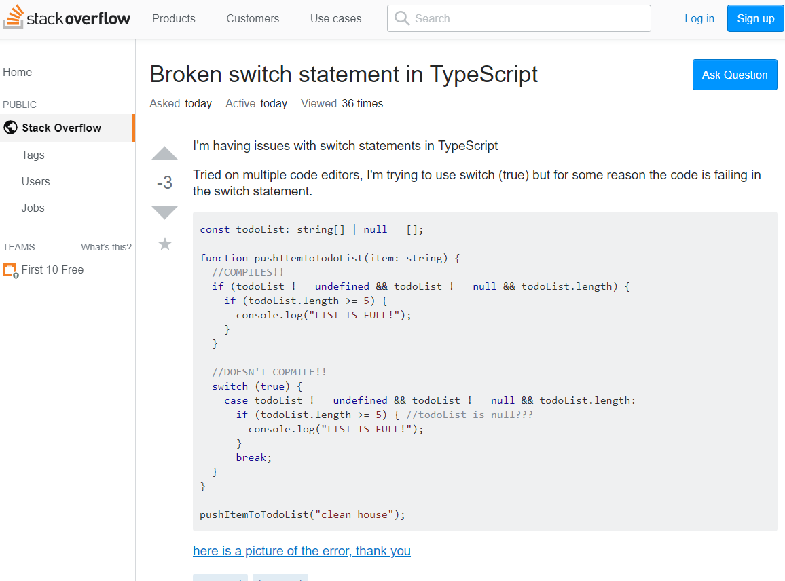

## Questions
  At the time of learning, questions are the best communication tool between an educator and students. However, educator often views the question that students ask is good or bad. In university, a good or bad question has a different effect on the student's education and learning.  When working on an assignment or learning new subjects, sometimes I get stuck at some material, and not sure what and how to ask for an answer.

  According to Eric Raymond, there is a process to ask questions in a good/smart way. At first, identify the thing you want to know or understand, and then before asking someone or professor, find the answer on your own. When asking the question, it must be direct and understandable and make sure the professor understand what you try to ask. [(How To Ask Questions The Smart Way, Eric Raymond)](http://www.catb.org/esr/faqs/smart-questions.html)

## StackOverflow

 
["Run async function every n seconds, wait if async function takes longer than n seconds"](https://stackoverflow.com/questions/57913896/run-async-function-every-n-seconds-wait-if-async-function-takes-longer-than-n-s) is a good example of how a good question should be asked. In this case, the questioner declares a question directly asking answer in a specific function and method. Which it identifies the method he/she is using and process and outcome of the resole that he/she wanted.

 ["Broken switch statement in TypeScript"](https://stackoverflow.com/questions/57914904/broken-switch-statement-in-typescript) is a bad example of a question. In this questioner case, the question is unorganized and misleading. The form of the question is a mix of random key words and without any detail to support or provide the answer he/she wants.

Those questions, provide a clear value of how a good question helps one at their education and the way to ask a good question. Sometimes, a good question is better than just reading about some material.

