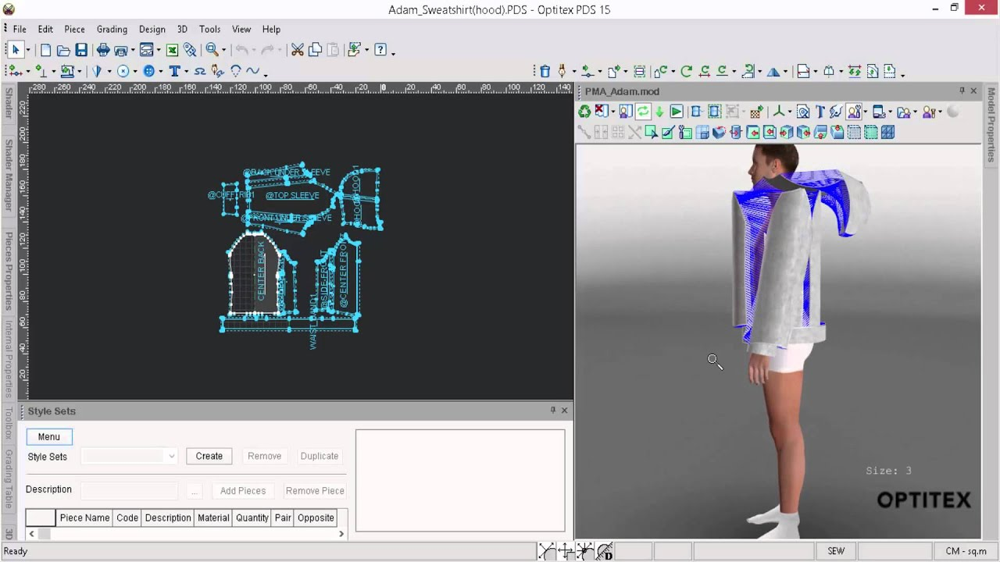

## Computer-Aided Design

The concept of Computer-Aided Design is to use computer applications and software to aid and create a virtual image design or/and 3d object. 
As a computer science student, I want to see the difference and connection of modern computer software from development to use interface.
In the Manoa course FDM 338, the Computer-Aided Design is focused on virtual garment design, which designs new garments with a special concept.

### 2D Design

The 2D module design consists of drawings and images, which display the concept and idea from the outline and figure. 
Often, it uses drawing and image software. In the course, I use Adobe Illustrator and Adobe Photoshop for creating the 2D garment flat design by drawings the outline and layering the patterns and photos on it.

### 3D Design

The 3D module design consists of the 3D virtual object, which display the physics form of the object. 
In the course, I use the Optitex software to design the 3D garment.

##### Optitex

Source: <a href="https://drive.google.com/drive/folders/1XNXp-QvWUa5L2IwNfTFVYcXT-cTCxB5O?usp=sharing"><i class="large github icon "></i>Weixiao Hu Computer-Aided Design (Concept: computer science) </a>
