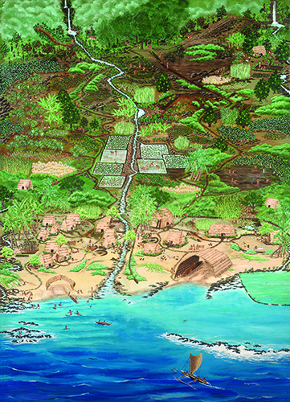

Mālama I Nā Ahupuaʻa (MINA) is a service learning that I participated in BOT 105, at Spring 2106. The service learning project helped me learn and understand the traditional cultures, practices, and beliefs of the Hawaiian people and lands.

Mālama I Nā Ahupuaʻa is a first-hand experience for young people to see and learn how the Ahupuaʻa system work, in which the Mālama I Nā Ahupuaʻa are trying to revive and maintain the Hawaiian traditional practices to sustain the land.

In this project, I learn many new things about the Hawaii culture, for example, planting Taro for the traditional system, building a fish pond by the beach, and learn the practices of the Hawaiian temple. Mālama I Nā Ahupuaʻa is a great experience for anyone to learn about Hawaii.

Source: <a href="http://socialsciences.hawaii.edu/access/engagement/mina.html"> Mālama I Nā Ahupuaʻa (MINA)</a> ,
<a href="https://www.kapiolani.hawaii.edu/wp-content/uploads/2018/12/MalamaMINAPoster.pdf"> Malama MINA Poster</a> 
