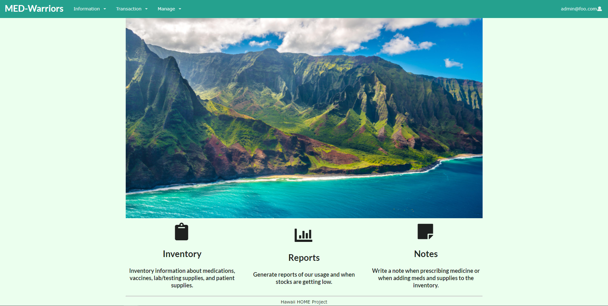

## Hawaii H.O.M.E. Project
 
The Hawaii H.O.M.E. (Homeless Outreach & Medical Education) Project is a volunteer project founded by John A. Burns School of Medicine (JABSOM) student 
and University of Hawaii premedical students. The project main force is to improve the quality and access to health care for individuals in Hawaii that experiencing houselessness. 
Also, increasing student and physician awareness and understanding of the houseless and their healthcare needs.

## Med-Warriors

In the Manoa class ICS 414 of fall-21, the professor assign the customer Hawaii H.O.M.E. Project to the class, 
and ask to us to create a working database application for they managing and maintain the medication and medical supply which it own. 
I was assign to a group of 7, we come up the group name Med-Warriors and we use the same name for the app.
For the application project, we use GitHub and Meteor to setup a private database。
In the process developing the app, we faced a lot of problems. 
The most troubles are that app users often is volunteer which making set private access difficult and setup of database use the medication product code.
In the end, we create a simple working application and customer was satisfied, but still they want a more better app and continue let other people or use the app as a base.

Source: <a href="https://med-warriors.github.io/"><i class="large github icon "></i>med-warriors.github.io</a>
