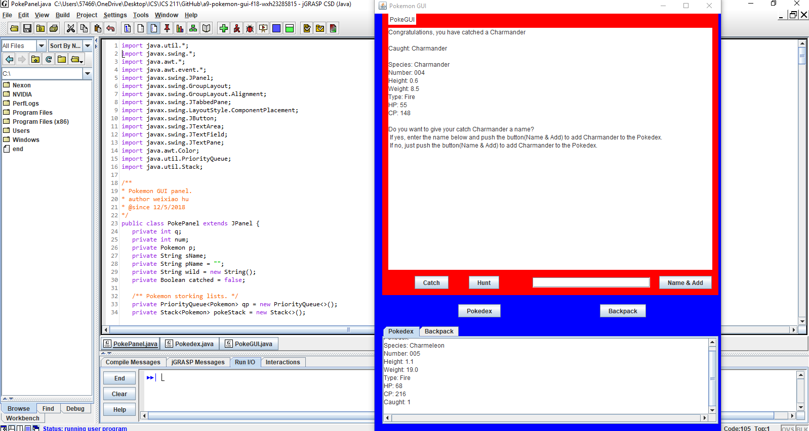

Pokedex GUI was programmed in Java using jGrasp and Eclipse GUI designer, and it was the final project of Computer Science II (ICS 211) class. In the ICS 211 class, all the assignments were using Pokémon as a basic concept to develop the Java coding experience, such as creating objects, class, arrays, linked lists, interfaces, inheritance, comparable, search function, tree, and more. All the past an assignment was the steps to making the final project (Pokedex GUI). The first assignment of the course was to create objects to contain Pokémon, the starter was Bulbasaur, Charmander, Squirtle, and their evolutions. Laster assignments were using arrays and linked list to hod and storage the Pokémon class, and create a binary search tree and comparable function to identify every Pokémon class, which is the code of a program that makes up the final project (Pokedex GUI).

The Pokedex GUI is operated by imitating the catching system in the Pokémon game series by randomly generating one of Pokémon classes that created in the Java language and allowing the user to attempt to catch it. When the Pokémon is caught, it provides a statement asking the user to name the Pokémon and add to a binary search tree, which represents the Pokedex, and an ArrayList, which represents the user’s backpack. When the user clicks the “Pokedex” icon, each type of Pokémon caught is listed by Pokémon number with their information. The backpack icon can be sorted by most recent caught and Pokedex number using a drop down menu all caught Pokémon.

This individual project that required files I had made throughout the semester and provides an opportunity for me to combat every concept of Java program language that I learn into an operable program. Additionally, this project makes me understand I still need more learning and experiment programming to create a better game or operable program further on in the computer science path.

Source: <a href="https://github.com/ICSatKCC/a9-pokemon-gui-f18-wxh23285815/tree/develop"><i class="large github icon"></i>Github Project [PokeGUI]</a>
