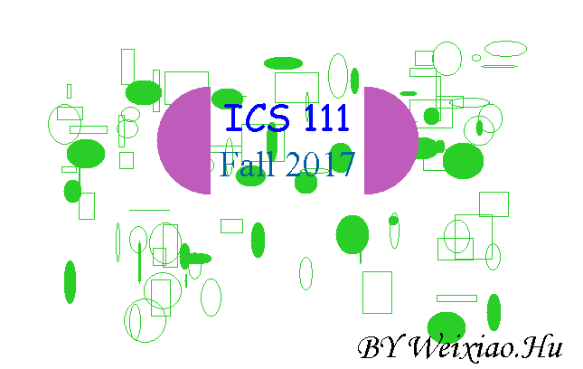

The art GUI name tag is the last assignment that I created for ICS 111. This assignment is to let the programmer get familiar with the Java GUI coding style and properties. In a week, I try to use all I learn about the GUI word font, color, shape, and layout to look more artistic. It was a fun experience to use GUI to some art.

Code example of the Java GUI:  

<pre>

import java.applet.*;
import java.awt.*;
import java.util.*;

public class Art extends Applet{
   int x=40;
   int y=50;
   int wh1=0;
   int wh2=0;
   Random r = new Random( );
   
   public void paint(Graphics g){
   //seting the font
      Font f1 = new Font("Comic Sans MS", Font.PLAIN, 40);
      Font f2 = new Font("Times New Roman", Font.PLAIN, 40);
      Font f3 = new Font("Monotype Corsiva", Font.PLAIN, 40);
   
   //seting the new color
      Color myColor1 = new Color(191, 91, 187);
      Color myColor2 = new Color(0, 94, 167);
      //seting the random color
      int rColor1 = r.nextInt(255);
      int rColor2 = r.nextInt(255);
      int rColor3 = r.nextInt(255);
      Color myColor3 = new Color(rColor1, rColor2, rColor3);
      
   //paint out the words and shapes
      for(int loop = 1; loop <= 30; loop++){
         g.setColor(myColor3);
         wh1 = r.nextInt(50);
         wh2 = r.nextInt(50);
         x = r.nextInt(500)+50;
         y = r.nextInt(300)+50;
         g.fillOval(x,y,wh1,wh2);
         g.drawRect(x,y,wh1,wh2);
         g.drawOval(x,y,wh1,wh2);
      }
      
      g.setColor(myColor1);
      //(x,y,w,l,begin deg, counter-clock wise in deg)
      g.fillArc(180,100,120,120,90,180);
      g.fillArc(350,100,120,120,270,180);
      
      //painting text
      g.setColor(Color.blue);
      g.setFont(f1);
      g.drawString("ICS 111",255,150);//(String, x, y)
      
      g.setColor(myColor2);
      g.setFont(f2);
      g.drawString("Fall 2017",250,200);
      
      g.setColor(Color.black);
      g.setFont(f3);
      g.drawString("BY Weixiao.Hu",400,400);
   }//close paint
   
}//close class

</pre>

