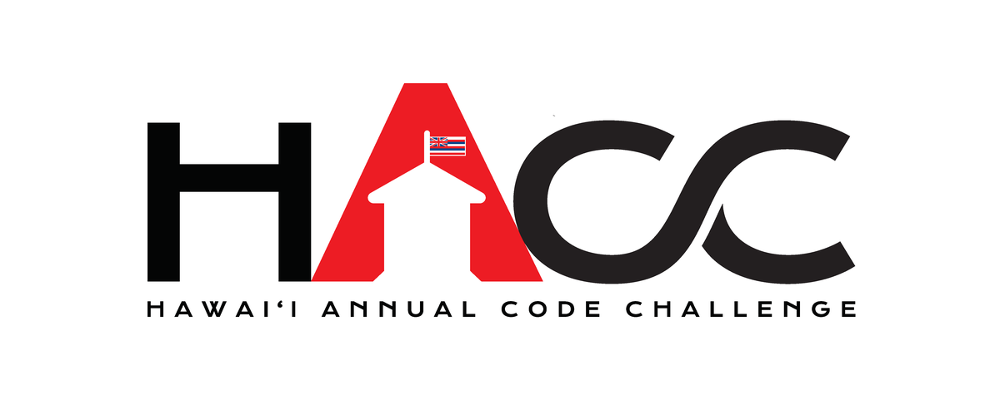
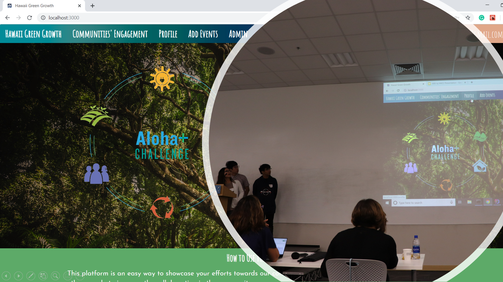

## HACC (Hawai'i annual code challenge)

<a href="https://hacc.hawaii.gov/"> HACC </a> is a government program for technology developers and programmers to create helpful solutions for sustaining the Hawaii community. At the HACC, the government has already provided some local issues and problems for people to solve.  The HACC is not only for technology developers and programmers it also for people in business and marketing. They are trying to increase the awareness of technology developers and programmers in Hawaii.

## 600IQ (Team)

#### Malama Hawaii

In the HACC, I participated in the challenge of a team of six calls the "600IQ". Our team takes on ETS/HGG Community Engagement & Digital Storytelling challenge. What we did is created a web app of a social media network that calls "Malama Hawaii" for people to share and tell their stories and activities help to sustain Hawaii. Also, keep track of the sustainable activities that people did statewide. For the website, our team used meteor as a foundation for the website, and slowly change and adding information until it became a working website allow people to post the sustain activities. 

Source: <a href="https://github.com/HACC2019/600-iq"> 600IQ (HACC)</a>
